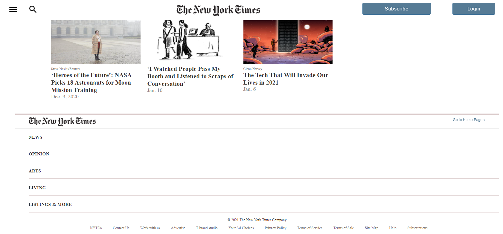

# HTML/CSS The New York Times Website Clone

This project is a capstone project developed as a completion of HTML & CSS section of Microverse main curriculum. It is a calloabrative project to showcase HTML & CSS Skills. It is a real-world-like project cloned from The New York Times website. 

## Desktop

## Tablet

## Mobile

## Built With

- HTML,
- CSS
- Stylelint

## Live Demo

<a href="https://rawcdn.githack.com/tta2yta/The-New-York-Times-WebSite/d72b91901f28d096bc40668ed440d796b78994c6/index.html">Live version</a>

## Author

👤 **Matija Maksimovic and Tedros Tesfay**

- Github: [Tedros Tesfay](https://github.com/tta2yta)
- Github: https://github.com/Mandeln
- Emaii: tta2yta@gmail.com
- Email: malistgulvexohmlosur@gmail.com

👤

## 🤝 Contributing

Contributions, issues and feature requests are welcome!

Feel free to check the <a href="https://github.com/tta2yta/The-New-York-Times-WebSite/issues" target="_blank">issues page</a>.

## Show your support

Give a ⭐️ if you like this project!

## Acknowledgments

- <a href="https://www.microverse.org/" target="_blank">microverse.org</a>
- <a href="https://www.w3schools.com/" target="_blank">w3schools.com</a>
- <a href="https://www.theodinproject.com/" target="_blank">The Odin Project</a>
- <a href="https://www.stackoverflow.com/" target="_blank">Stackoverflow</a>
- <a href="https://css-tricks.com/" target="_blank">CSS-TRICKS</a>
